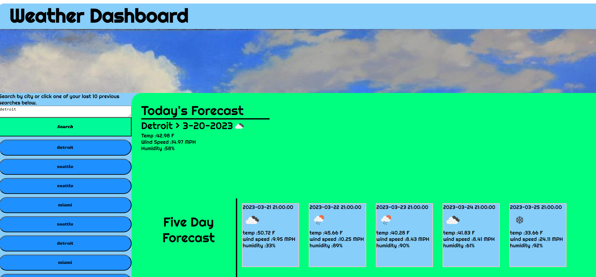

# Weather Dashboard

## Description

Here is a template for making a website that fetches data from "https://api.openweathermap.org" and displays it in the specified elements. There is a search function that updates everytime you search and saves the searches to the local storage and creates button elements for the last 10 searches the user has entered. There is a forecast container and a five day forecast container that recieves the specified data fetched.

### Screenshots

### Deployed Website Link

https://algorithmnblues92.github.io/weatherdashboard/